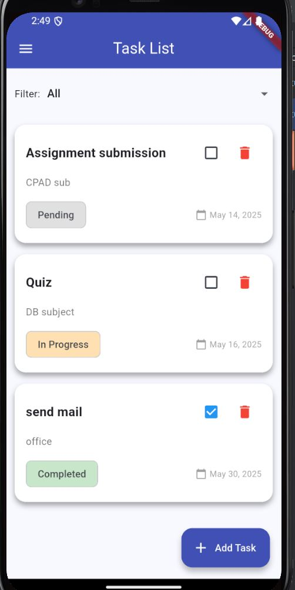
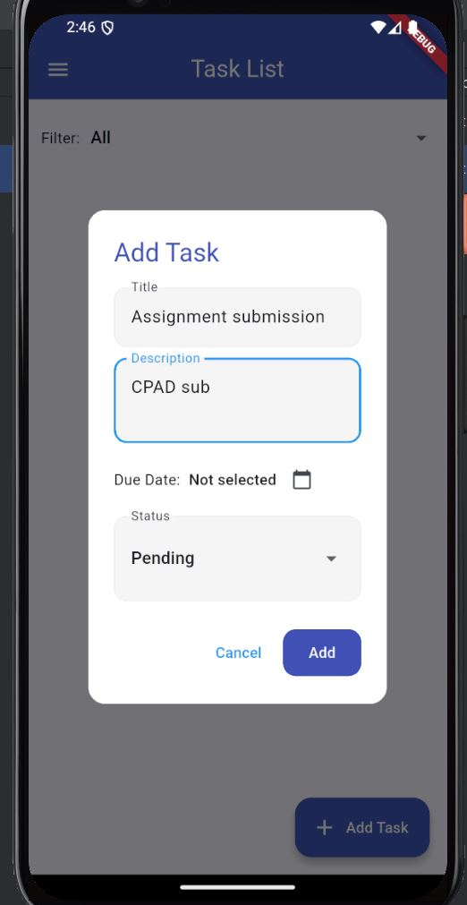

# Flutter Task App with Back4App Integration

This is a Flutter mobile application integrated with Back4App (Parse Server) to provide user authentication and task management features. The app allows users to sign up, log in, and manage their personal tasks in the cloud with full CRUD functionality.

---

## 🚀 Features

- **User Authentication**

  - Sign up with username, email, and password
  - Log in with email and password
  - Persistent login sessions
  - Logout functionality

- **Task Management (CRUD)**

  - Add a new task with title, description, due date, and status
  - View tasks in a scrollable list
  - Edit task details and status
  - Delete tasks

- **UI/UX**

  - Responsive and modern Material Design
  - Color-coded task status chips
  - Date picker for due dates
  - Form validation for all inputs
  - Drawer menu with logout option

- **Backend (Back4App)**

  - Uses Parse SDK for Flutter
  - Handles user sessions, data storage, and queries
  - Data is stored securely in the cloud

---

## 🧰 Technologies Used

- **Flutter**: Frontend UI development
- **Dart**: Programming language
- **Back4App**: Backend-as-a-Service platform
- **Parse SDK**: Used for API communication and session management

---

## 📸 Screenshots

### 🔐 Login Screen


### 📋 Task List



### ➕ Add Task Dialog



---

## 🛠️ Installation & Setup

1. **Clone the repository:**

```bash
https://github.com/Sagar-BITS/flutter-app-assignment
```

2. **Install dependencies:**

```bash
flutter pub get
```

3. **Setup Back4App credentials:**

- Initialize Parse in `main.dart` with your Back4App `Application ID`, `Client Key`, and `Server URL`

```dart
await Parse().initialize(
  'YOUR_APP_ID',
  'https://parseapi.back4app.com/',
  clientKey: 'YOUR_CLIENT_KEY',
  autoSendSessionId: true,
);
```

4. **Run the app:**

```bash
flutter run
```

---

## 🎬 Demo

- **YouTube Video:** \[https://youtu.be/rzsBG7FfZg4]

---

## 📁 Project Structure

```
/lib
  /config      # Back4App configuration
  /models      # User & Task model
  /screens     # UI screens (login, signup, tasks)
  /services    # AuthService and TaskService
main.dart      # App entry point
```

---

## 🙋‍♂️ Author

**Your Name**
[GitHub](https://github.com/Sagar-BITS)

---
